<link href="style.css" rel="stylesheet"></link>

<div align="center" style="display:grid;place-items:center;">

<h1>LayoutCSS</h1>
<p>Create your responsive layout with html only</p>
<p>Spend your time on what really matters </p>

[![Donation][DonationBadge]][DonationUrl]
[![Discord][DiscordBadge]][DiscordUrl]
</div>

[DiscordBadge]: https://img.shields.io/discord/1151460678280949821?label=Discord&logo=discord&logoColor=white
[DonationBadge]: https://img.shields.io/badge/Donation-7ba2f2?logo=stripe&logoColor=white


[DiscordURL]: https://discord.gg/trP6WABgYE
[DonationURL]: https://buy.stripe.com/aEU6qjbMu5cMaNa5kk 

## How to use ?

- First you have to install layoutcss globally, it's very simple, just run : `npm i -g @nimbusteam/layoutcss`
- Then go into your node project (at the root) and run `layoutcss init`. It will create the following config file :
```js
{
  "input": {
    "directory": ".", // The folder you want to watch
    "extensions": [".html"], // the extensions you want to watch, if you want to watch svelte files just replace .html by .svelte
  },
  "style": {
    "harmonic-ratio": 1.515, // the harmonic ratio of the harmonic scale
    "min-screen": "600px", // the min size where the font stop resizing
    "max-screen": "1200px", // the max size where the font stop resizing
    "base-value": "16.5px", // the font-size at max-screen and upper
    "resizing-ratio": 1.1, // the resizing ratio of the font between max-screen and min-screen (at min-screen the font-size will be base-value/resizing-ratio)
  },
  "output": {
    "file": "./layout.css",// the css file generated by layoutcss
  },
};
```
- Finally just launch `layoutcss watch` in the same directory than the config file generated by `layoutcss init`
- If you want to use it with svelte, react or whatever just modify package.json like this, this is an example with svelte :
```js
"scripts": {
	"dev": "vite dev & layoutcss watch",
    ...
}
```

## The concept

LayoutCSS is a css framework that manage all the layout of your page (the skeleton), and lets you create your style the way you want. 
If you take a look at your CSS, you will see that approximately 90% of it, is layout related (like flexbox, grid, media queries etc) and the remaining 10% is about “true style”, like color, shadow, etc. 

Thanks to this approach, you have a major gain of time, your code is drastically reduced, and you are left with a total freedom.

Using LayoutCSS is deciding to spend time in the aspect that really matters ... your creativity ! 

LayoutCSS lets you create your layout directly from the html, thanks to custom elements that we call components. You can customize those components for your needs with different attributes specific to each component.

Thanks to this approach you are giving a real meaning to your html, and it becomes super easy to manage. Just take a look at this piece of code:

```html
<sidebar-l side-width="200px" side="left">
    
    <center-l max-width="500px">
        <p> Welcome to LayoutCSS <p>
    </center-l>
</sidebar-l>
```

But the best way to discover the full potential of LayoutCSS is to try it yourself !


## Table of Contents

<table>
<tr><td valign=top>

* [Components](#components)
    * [The Box](#the-box)
    * [The Center](#the-center)
    * [The Ledge](#the-ledge)
    * [The Rack](#the-rack)
    * [The Stack](#the-stack)
    * [The Grid](#the-grid)
    * [The Slider](#the-slider)
    * [The Switcher](#the-switcher)
    * [The Outsider](#the-outsider)
    * [The Extender](#the-extender)
    * [The Sidebar](#the-sidebar)
    * [The Icon](#the-icon)

</td><td valign=top>

* [Utilities](#utilities)
    * [bg-img](#bg-img)
    * [p](#p)
    * [p-recursive](#p-recursive)
    * [p-child](#p-child)
    * [ratio](#ratio)
    * [flex](#flex-utilities)
    * [hide-under](#hide-under)
    * [hide-over](#hide-over)
    * [font-size](#font-size)
    * [relative](#relative)
    * [z-index](#z-index)
    * [line-height](#line-height)

</td></tr>

</table>

# Components

## The Box

```html
<box-l max-width="1000px">...</box-l>
```

The box component, is literally a box for you to put some content.

It allows you to define a max width, and if you do, its width won't depend on the content width.

-   max-width : define the max-width of the box.

### Examples

In this example, we didn't gave a max-width to the box, so as you can see, the box width is based on its content.

```html
  <box-l>
    <p p="1">My parents width is based on my size</p>
  </box-l>
  <box-l>
    <p p="1">Mine too</p>
  </box-l>
```


<hr>

Here we have 2 box with a max-width defined.

```html
  <box-l max-width="300px">
    <p p="1">My parents width isn't based on my size</p>
  </box-l>
  <box-l max-width="500px">
    <p p="1">Mine either</p>
  </box-l>
```


<hr>

## The Center 

```html
<center-l max-width="1000px" and-text recursive>...</center-l>
```

The center allows you to horizontally center an element.

Before LayoutCSS, you had to create a flexbox with justify-content: center and create an element with a fixed max-width inside.

Now you just have to use a center component with a specified max-width value to achieve the same result.

-   max-width : define the max-width of the center.
-   and-text : center the text inside the center.
-   recursive : center child elements inside the center.

### Examples

The first example is really simple, here we create a center with a max-width of 500px and as you can see the element is centered and its width is 500px.

```html
  <center-l max-width="300px">
    <p p="1">Hello World!</p>
  </center-l>
```
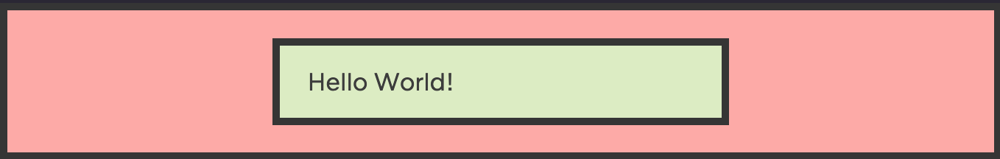

<hr>

Here, the center does not have a max-width attribute, so it takes the width of its content.

```html
<center-l>
    <p p="1">Hello World!</p>
</center-l>
```
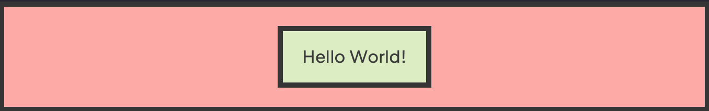

<hr>

If you want your text to be centered as well, just use the and-text attribute. All descendants (children and grand children) will have the same behavior!

```html
  <center-l max-width="300px" and-text>
    <p p="1">Hello World!</p>
  </center-l>
```
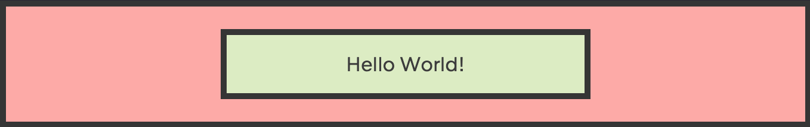

<hr>

The recursive attribute will center all child elements inside the center! However, grandchildren's and other descendants are not centered.

When you use recursive, the center become a flexbox and horizontally center its content.

```html
<center-l max-width="400px" recursive p="1">
    <p p="1">Hello World!</p>
    <div p="0">
      <span>Look at me ! I'm not centered.</span>
      <span>But my parent is !</span>
    </div>
</center-l>
```
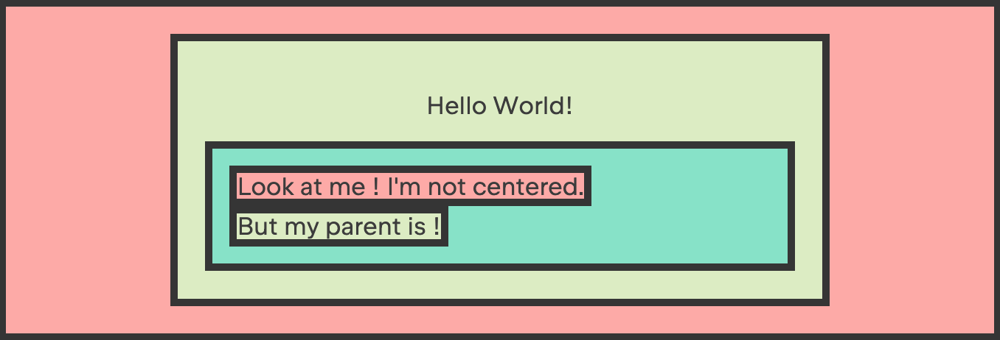

## The Ledge

```html
<ledge-l justify="space-between" align="center" gap="3" twin-width> ... </ledge-l>
```

The Ledge is a flexbox that allows you to get the elements in a row display.

It automatically wraps when the content overflows.

The twin-width attribute gives the same width to all the child elements.

-   justify: the justify-content value
-   align: the align-items value
-   gap: the space between the elements
-   twin-width: give the same with to every elements
-   nowrap: unable the natural wrapping of the ledge

### Examples

The gap attribute allows you to space elements. If you don't set a gap value, the elements will be side by side. 

```html
<ledge-l p="1" gap="1">
  <p p="1">Element 1</p>
  <p p="1">Element 2</p>
  <p p="1">Element 3</p>
</ledge-l>
```
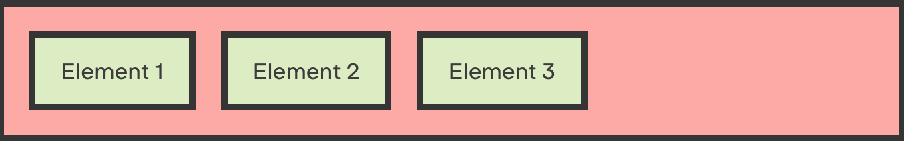
<hr>

To manage the horizontal alignment of child elements, you just need give a value to the justify attribute. You can set any value allowed in CSS, like center, space-between etc...

To manage the vertical alignment, use the align attribute, which is a replacement for the align-items property.


```html
<ledge-l p="1" gap="1" justify="center" align="center">
  <p p="1">1</p>
  <p p="1">2</p>
  <div p="1">
    <p>Oups...</p>
    <p>Im an higher Element</p>
  </div>
</ledge-l>
```
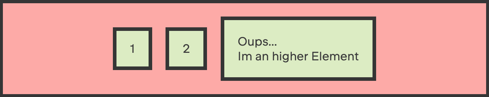
<hr>

The twin-width attribute will give the same width to all Ledge's children. It's very useful when you want different content width elements to be separated evenly.

```html
<ledge-l p="1" gap="1" twin-width>
  <p p="1">Element 1</p>
  <p p="1">Element 2</p>
  <p p="1">Oups... my content is longer than the others.</p>
</ledge-l>
```
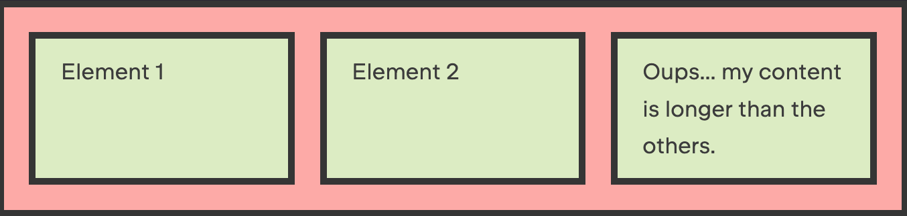
<hr>

When the attribute nowrap is defined on a ledge, it will never wrap.


```html
<ledge-l p="1" gap="1" nowrap>
  <p p="1">1</p>
  <p p="1">2</p>
  <p p="1">No matter how long my content is, this ledge will never wrap</p>
</ledge-l>
```
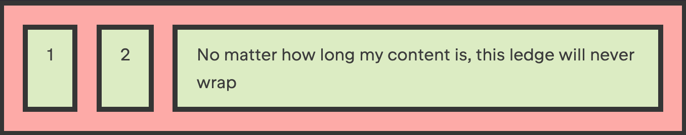
<hr>


## The Rack 

```html
<rack-l min-height="300px" gap="1">
  <div centered>Element 1</div>
</rack-l>
```

The Rack lets you create an element with a min-height value, you can use it to vertically center one of its child.

To define which element will be centered you just have to add the centered attribute (without value) to this element.

You can define a gap value that will be applied between non centered elements.

-   centered: an attribute you give to one of the children, it define which element will be centered
-   gap: the space between non centered elements
-   min-height: the minimum height of the Rack element
-   height: give a fixed height to the rack, when elements overflows in y-axis. the rack becomes scrollable. 

### Examples

The simplest use of the Rack is to set a min-height and only one element inside. If you remove the centered attribute on its child, you will see that the element is not vertically centered anymore. 

```html
<rack-l min-height="300px" p="1">
  <p p="-1" centered>Element 1</p>
</rack-l>
```
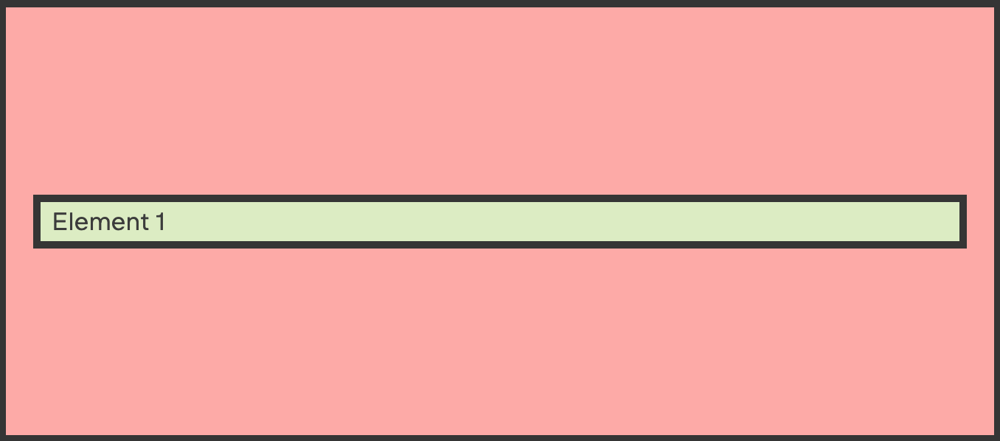

<hr>

In this exemple, you can see how the other elements are displayed around the centered element.

```html
<rack-l min-height="500px" p="1">
  <p p="-1">Element 1</p>
  <p p="-1">Element 2</p>
  <p p="-1" centered>Element 3</p>
  <p p="-1">Element 4</p>
  <p p="-1">Element 5</p>
</rack-l>
```
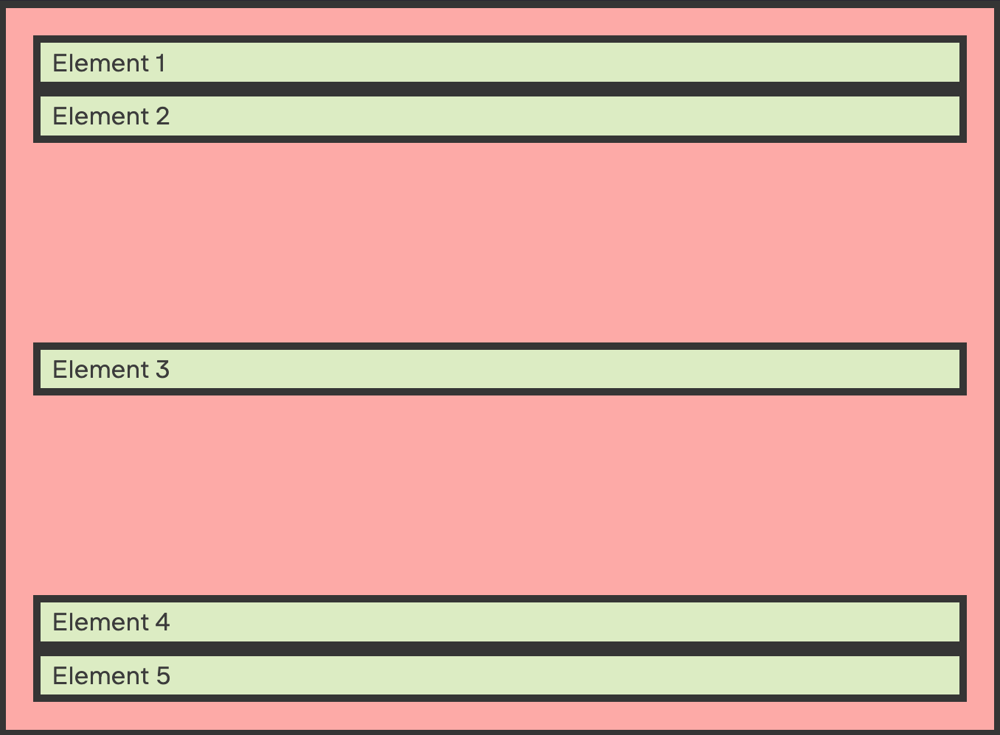

<hr>

If you use the height attribute, the Rack will have a fixed height and will be scrollable.

```html
<rack-l height="200px" p="1">
  <p p="1">Element 1</p>
  <p p="1">Element 2</p>
  <p p="1">Element 3</p>
  <p p="1">Element 4</p>
  <p p="1">Element 5</p>
</rack-l>
```
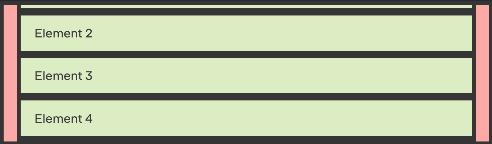

## The Stack

```html
<stack-l gap="1">...</stack-l>
```

The stack allows to vertically space elements. You don't need to set a margin directly to an element anymore. Instead, just create a stack with a gap parameter to space elements inside.

It space elements from each other, so the first and the last elements touch the border of the stack.

-   gap: the space value between elements

### Examples

Here we just set a gap value on the stack, as you can see the first and last element touch the top/bottom of the stack because the gap only space elements from each other.

```html
<stack-l gap="1">
  <p p="1">1</p>
  <p p="1">2</p>
  <p p="1">3</p>
  <p p="1">4</p>
</stack-l>
```

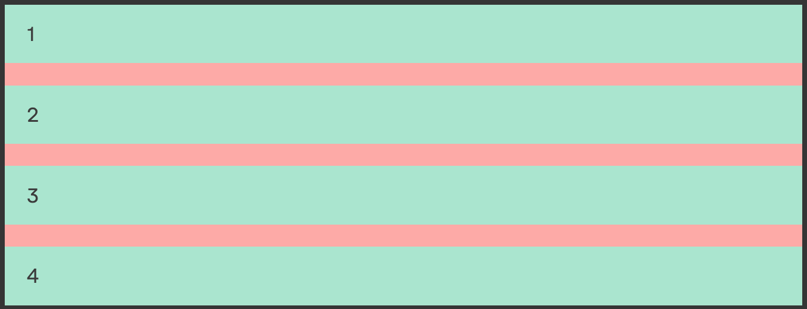

<hr>

If you set the `recursive` attribute all elements (children and grand children) will be spaced equaly.

```html
<stack-l gap="1" p="1" recursive>
  <div p="1">
    <p p="1">a</p>
    <p p="1">b</p>
    <p p="1">c</p>
  </div>
  <p p="1">2</p>
</stack-l>
```
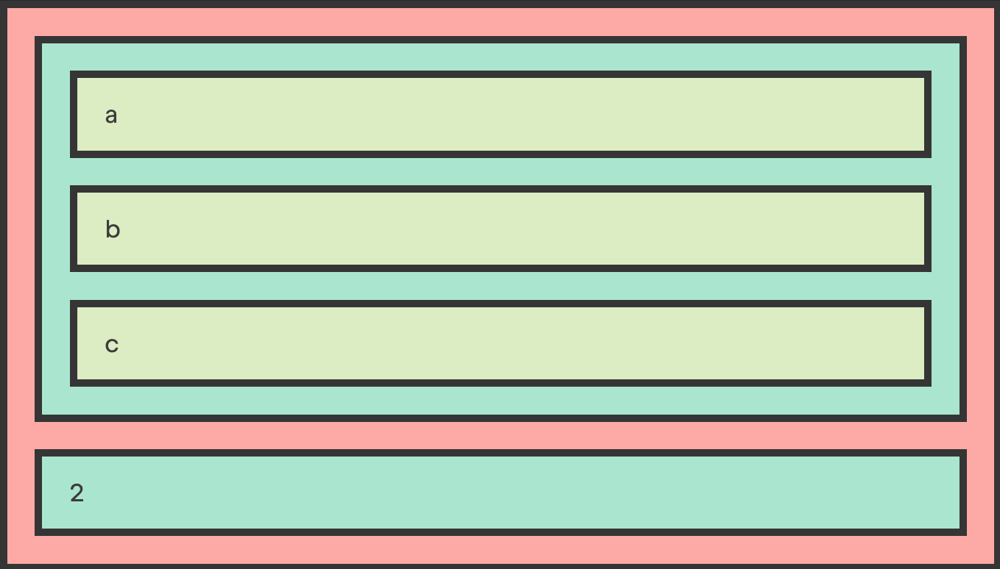

## The Grid

```html
<grid-l min-cell-width="100px" min-cols="3" max-cols="5" gap="3"> ... </grid-l>
```

The grid component is a responsive grid without breakpoints.

To be responsive the grid need a `min-cell-width` attribute, this value will be the min width of each cell. The grid will adapt its number of column to preserve this value.

You can define a `min-cols`/`max-cols` attribute to set a min/max number of columns.

-   min-cell-width: define the minimum width of the grid cells.
-   gap: define the gap between grid cells
-   min-cols: the minium number of columns
-   max-cols: the maximum number of columns

### Example

In this simple example, you have a min-cell-width of 150px. So, if the page is resized, the number of columns change to keep the cell width bigger than 150px.

```html
<grid-l min-cell-width="150px">
  
  
  
  
  
</grid-l>
```
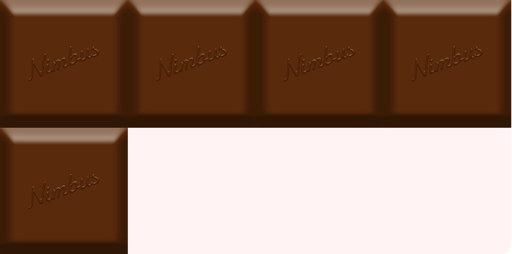

<hr>

Here you have a `gap` value, which space the elements and a `max-cols` value which define the maximum numbers of columns allowed

```html
<grid-l min-cell-width="120px" max-cols="4" gap="2">
  
  
  
  
  
</grid-l>
```
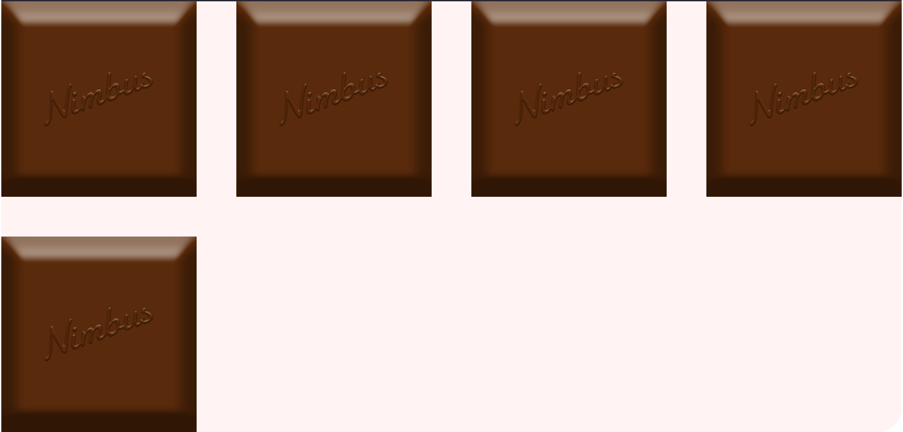

<hr>

If you want to define a minimum numbers of columns, you just have to set a `min-cols` value. Here, we have only 2 elements, but the grid have 3 columns thanks to the `min-cols` value

```html
<grid-l min-cell-width="150px" min-cols="3" gap="2">
  
  
</grid-l>
```


<hr>

You can define `min-cell-width`, `min-cols` and `max-cols` on the same grid. In this example, the grid will never have more than 4 columns and never less than 2 columns. 

```html
<grid-l min-cell-width="150px" min-cols="2" max-cols="4" gap="2">
  
  
  
  
  
</grid-l>
```
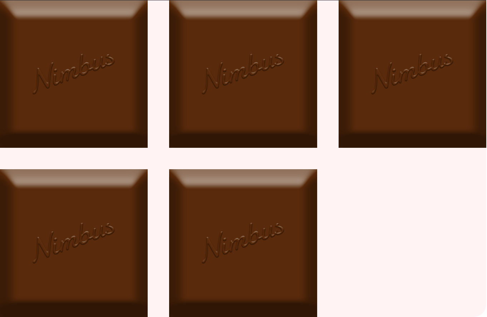

## The Slider

```html
<slider-l item-width="200px" height="200px" gap="2" hide-bar>... </slider-l>
```

The Slider is a component that lets you define a fixed height and width to elements that will be placed inline. Therefore you can easily create a carrousel for your pictures.

-   item-width: the width of child elements.
-   height: the height of the slider component.
-   gap: the space between child elements.
-   hide-bar: hide the scroll bar.

### Examples

Here we defined the slider's height at 200px and item-width at 250px. 

```html
<slider-l height="250px" item-width="200px">
  
  
  
  
  
  
</slider-l>
```

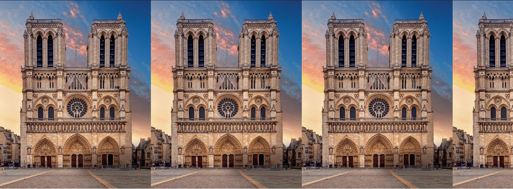

<hr>

In this example we set a item-width value in percentage, in this case each element take 25% of the visible width. We use a gap set to 1 to space elements between them.

```html
<slider-l height="250px" item-width="25%" gap="1">
  
  
  
  
  
  
</slider-l>
```

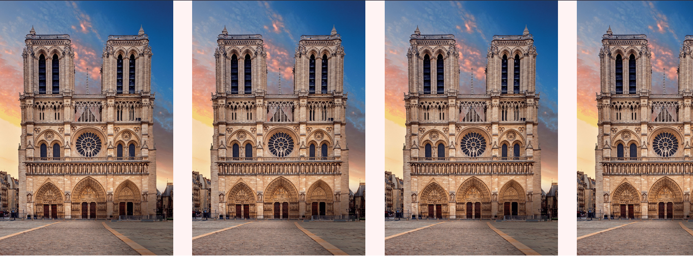

<hr>

If you add the attribute `hide-bar` you can see that the scroll bar is not visible anymore. It can be usefull if you want to create a carousel with left and right arrow as the only way to navigate between elements.

```html
<slider-l height="250px" item-width="200px" gap="2" hide-bar>
  
  
  
  
  
  
</slider-l>
```

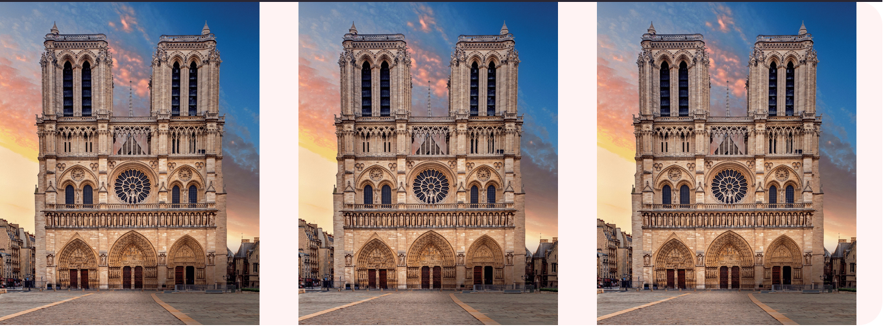


## The Switcher 

```html
<switcher-l threshold="250px" gap="3"> ... </switcher-l>
```

The switcher is a flexbox which display its elements in a row and at a specific width its layout change from row to column.

You don't have to use any media queries and the breakpoint is not based on the screen width, but on the switcher width!

-   threshold: is a width value representing the switcher breakpoint.
-   gap: the space between child elements.
-   reverse: change the order of the elements when wrapped (the last child will be on top, and the first one on the bottom)
-   limit: define the maximum number of elements that a switcher can contain before switching. 

### Examples

In this example, when the switcher width is smaller then 500px, its layout switch from row to column. 

```html
<switcher-l threshold="500px" gap="1" p="1">
  <p p="1">element 1</p>
  <p p="1">element 2</p>
</switcher-l>
```

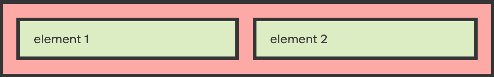

<hr>

Here you see that we have fixed a limit to only 2 elements, therefore, because we have 3 elements, the switcher is switched.

```html
<switcher-l threshold="500px" gap="1" limit="2">
  <p p="1">element 1</p>
  <p p="1">element 2</p>
  <p p="1">element 3</p>
</switcher-l>
```

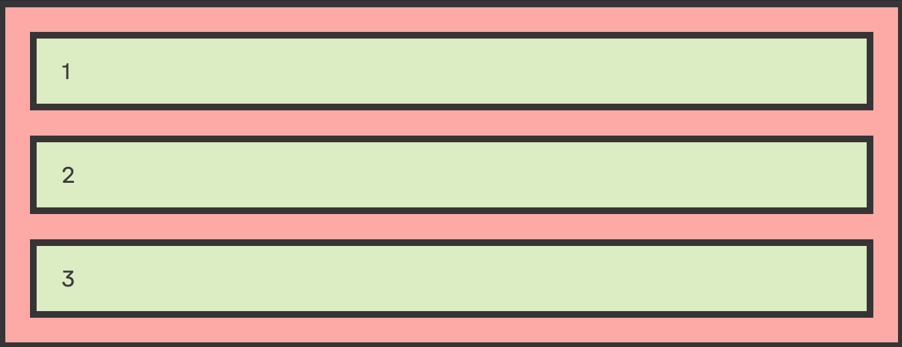

## The Outsider

```html
<outsider-l position="absolute" top="20px" right="10%">... </outsider-l>
```

The Outsider, is very usefull to build absolute positionning.

You can give it any position attribute (absolute, fixed, sticky, relative) and then specify its position with top, bottom, left, right.

-   position: the position value of the Outsider, you can use any value allowed in css (absolute, fixed, sticky, relative).
-   top: the top position value.
-   bottom: the bottom position value.
-   left: the left position value.
-   right: the right position value.

### Examples

A simple example to show you how to set an element in the right top corner of its parent with the Outsider:

```html
<stack-l gap="1" relative>
  <outsider-l position="absolute" right="0px" top="0px">
    <p p="1">1</p>
  </outsider-l>
  <p>Hello</p>
  <p>Hello</p>
  <p>Hello</p>
  <p>Hello</p>
  <p>Hello</p>
</stack-l>
```
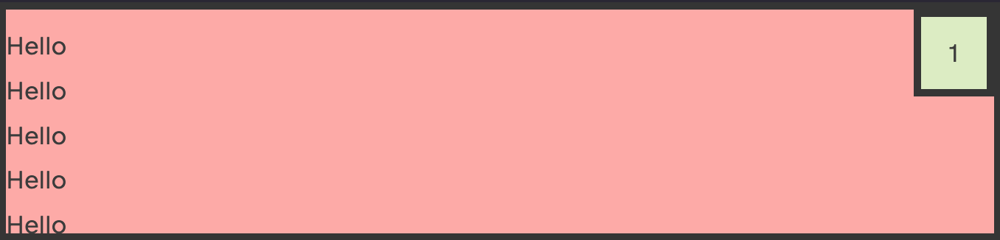

<hr>

Here, the Outsider is sticky, it sticks to the top of its relative parent.

```html
<rack-l min-height="150vh" relative>
  <outsider-l position="sticky" top="80px" p="-2">
    <p>1</p>
  </outsider-l>
  <p>Hello</p>
  <p>Hello</p>
  <p>Hello</p>
</rack-l>
```

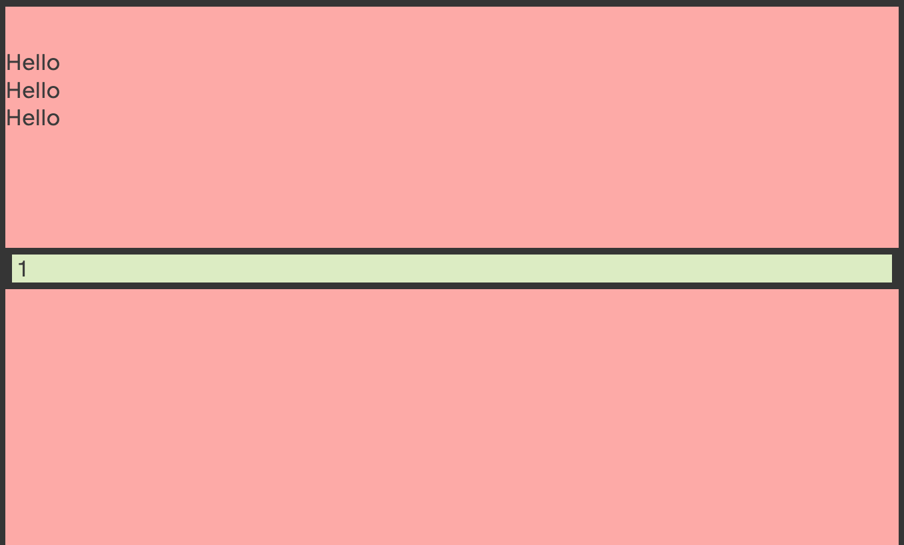

## The Extender

```html
<extender-l screen keep-center>... </extender-l>
```

The extender allows you to define an element to be wider than its parent.

It's very useful when you want for an element to take the width of its parent without taking the padding in count.

Or sometimes, you just need for an element to take the screen width and for it to stay in the flow of its parent.

-   screen: if you want the element to take the full screen width

### Examples
Here, the red div has a padding, but the extender will take full width of it beyond the padding.

Normally, you had to add the padding on each element, but with the extender, only the parent has a padding, and its child is still able to go past it.

```html
<div p="3">
  <p>Hello</p>
  <p>Hello</p>
  <extender-l ratio="16/4" bg-img="/static/images/notre-dame.jpg"></extender-l>
  <p>Hello</p>
  <p>Hello</p>
</div>
```

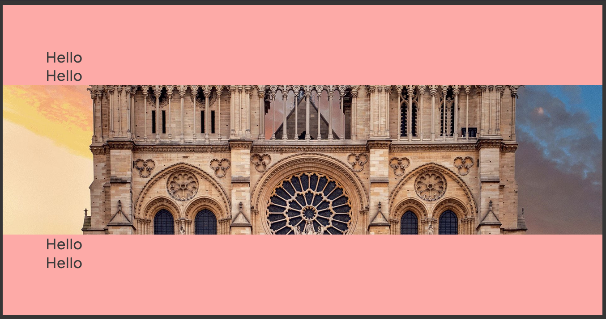

<hr>

A very cool feature of the extender, is the ability to extend in order to take the full screen width. The only limitation to this feature, is that you have to be in a horizontally centered element.

You just need to add the `screen` attribute to your element and that's it!

This way, you can keep your flow and show a full screen width element without leaving its parent.

```html
<div p="1">
  <p>Hello</p>
  <p>Hello</p>
  <extender-l screen>
    <p>Oh ! I take full screen width.</p>
  </extender-l>
  <p>Hello</p>
  <p>Hello</p>
</div>
```

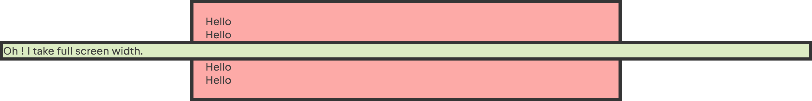


## The Sidebar

```html
<sidebar-l side="right" side-width="300px" content-min="60%" gap="2" shrink> ... </sidebar-l>
```

The Sidebar is a flexbox that give a fixed width to one of its children, and the space left to the other child. By default, the Sidebar switch to a vertical layout when the content Element's (the children that is not the sidebar) width is equal to 50% of the Sidebar component.

-   side: define the position of the Sidebar, left or right.
-   side-width: define the width of the Sidebar.
-   content-min: is a breakpoint defined on the content element's width, that wraps the component to a vertical layout.
-   gap: the space between the sidebar and the content element.
-   reverse: lets you wrap the sidebar with the content on top and the sidebar on the bottom.
-   shrink: by default, the Sidebar's children doesnt shrink, which means that both elements will have the same height. By giving the shrink attribute to the element, both children elements will adopt their natural heights.

### Examples

The first thing to do is to define the side of the sidebar.

If you want the sidebar on the left, you add `side="left"`.

```html
<sidebar-l side="left" p="0">
  <div p="1">
    <p>sidebar</p>
  </div>
  <div p="1">
    <p>content</p>
  </div>
</sidebar-l>
```


<hr>

If you want the sidebar on the right, you add `side="right"`.

```html
<sidebar-l side="right" p="0">
  <div p="1">
    <p>content</p>
  </div>
  <div p="1">
    <p>sidebar</p>
  </div>
</sidebar-l>
```
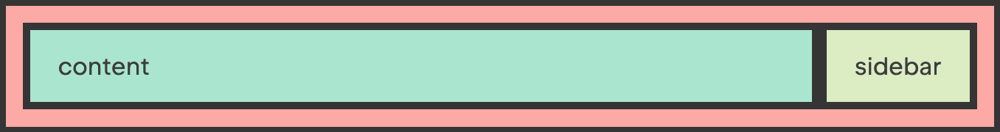
<hr>

You can define the width of the sidebar with `side-width`. (It gives a width to the side element only, not the content element).

```html
<sidebar-l side-width="240px" side="left" p="0">
  <div p="1">
    <p>sidebar</p>
  </div>
  <div p="1">
    <p>content</p>
  </div>
</sidebar-l>
```

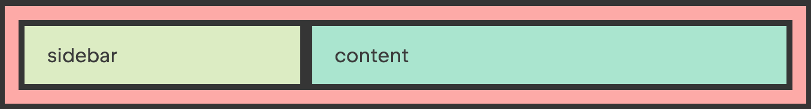

<hr>

 With `content-min`, you can define when the sidebar should wrap. If you set `content-min` to 60%, it means that when the content element's width will be smaller than 60% of the component, the sidebar will wrap. 

 ```html
 <sidebar-l content-min="60%" side="left" p="0">
  <div p="1">
    <p>sidebar</p>
  </div>
  <div p="1">
    <p>content</p>
  </div>
</sidebar-l>
 ```

 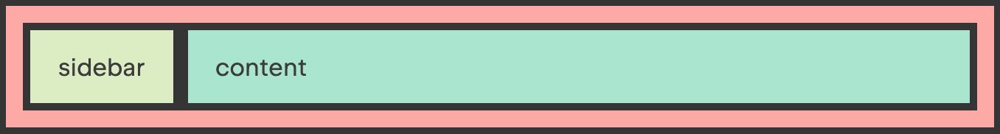

 <hr>

 If you want elements inside the Sidebar to take the height of their content you just have to add the `shrink` attribute.

 ```html
 <sidebar-l side-width="240px" shrink side="left" p="0">
  <div p="1">
    <p>sidebar</p>
  </div>
  <div p="1">
    <p>Lorem ipsum dolor sit amet, consectetur adipiscing elit, sed do eiusmod tempor incididunt ut labore et dolore magna aliqua. Ut enim ad minim veniam, quis nostrud exercitation ullamco laboris nisi ut aliquip ex ea commodo consequat.</p>
  </div>
</sidebar-l>
 ```

 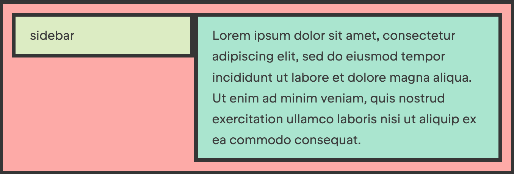

 <hr>

 The reverse attribute, lets you wrap the content the other way around. When wrapped, the content will be on top and the sidebar on bottom.

 ```html
 <sidebar-l reverse side-width="240px" side="left" p="0">
  <div p="1">
    <p>sidebar</p>
  </div>
  <div p="1">
    <p>content</p>
  </div>
</sidebar-l>
 ```

 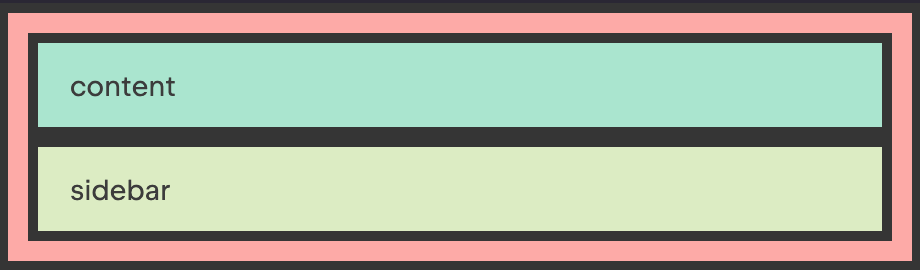

 <hr>

 One last thing, if you want to space the elements inside the Sidebar just use the `gap` attribute.

 ```html
 <sidebar-l gap="1" side="left" p="0">
  <div p="1">
    <p>sidebar</p>
  </div>
  <div p="1">
    <p>content</p>
  </div>
</sidebar-l>
 ```

 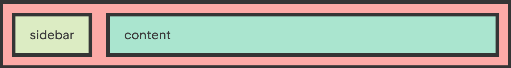

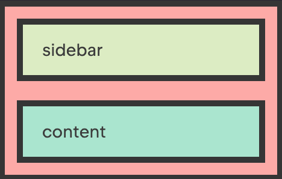

## The Icon 

```html
<h1><icon-l scale="1.3">... </icon-l> I'm the title</h1>
```

The Icon's purpose, is to give to an element the height of the text in which it is.

One cool feature, is that, if the `path` attribute is an svg, the svg code from the file will be injected into the icon so you can then manipulate the svg with some JS or CSS.

You can also define a scale attribute to make it bigger or smaller than the text.

-   scale: define the scale value of the element.
-   gap: define the space between the text and the icon.
-   gap-dir: defines on which side of the icon the gap should be

### Examples

As you can see, the icon is the same size than the text.

```html
<h3>
  <icon-l>  </icon-l>
  The icon is the same size as text !
</h3>
```

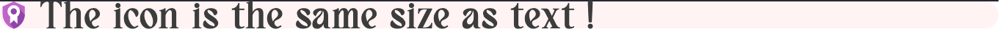

<hr>

Sometimes, you want the icon to be bigger or smaller than the text, to do so, you just have to define a `scale` attribute.

```html
<stack-l gap="1">
  <h3>
    <icon-l scale="0.7">  </icon-l>
    The icon is smaller than text !
  </h3>
  <h3>
    <icon-l scale="1.5">  </icon-l>
    The icon is bigger than text !
  </h3>
</stack-l>
```


<hr>

If you want a gap between the icon and the text, just define a `gap` value. It will space the icon form the text on both sides.

If you want the gap to be only directed to the begining or the end of the sentece define a gap-dir at "end" or "start".

```html
<stack-l gap="1">
  <h3>
    Like
    <icon-l gap="2" gap-dir="start">  </icon-l>
  </h3>
  <h3>
    <icon-l gap="2" gap-dir="end">  </icon-l>
    Like
  </h3>
  <h3>
    Like
    <icon-l gap="2">  </icon-l>
    Like
  </h3>
</stack-l>
```

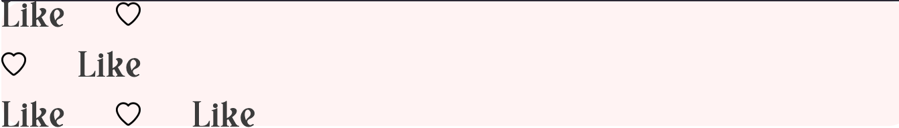

# Utilities 

## Bg-img

```html
<div bg-img="/images/exemple.jpg">...</div>
```

The Bg-img utility let you define a background image on any element (not only LayoutCSS components).

The background image has the following CSS properties:

```css
[bg-img]{
    background-repeat: no-repeat;
    background-position: center;
    background-size: cover;
}
```

### Example

To use this utility you just have to define the path of your image in the `bg-img` attribute.

```html
<div p="3" bg-img="/static/images/notre-dame.jpg">
  <p p="1">Some text...</p>
</div>
```

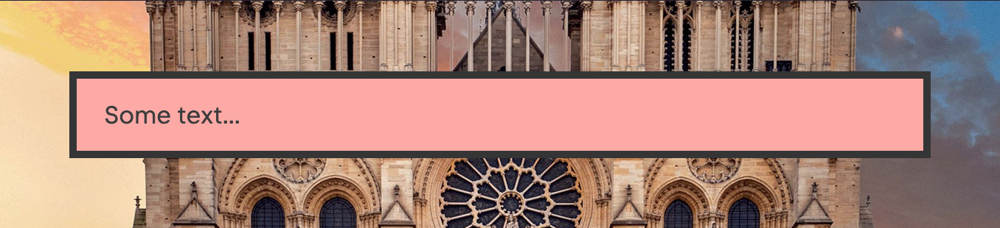

## Ratio

```html
<div ratio="1/3">... </div>
```

The ratio utility defines the proportions of an element.

Imagine you want an image in a 16/9 format. To achieve that you just need to add `ratio="16/9"` to your image.

You can set ratio as fraction (like 16/9) or as decimal number (like 0.3)

This proportions will be kept on every screen-size.

### Example

```html

```


## P

```html
<div p="3">...</div>
```

The p utility give padding to an element.

You can choose which kind of padding you will add, for example if you set `px="3"` your element will receive an horizontal padding of 3.

You can use the following p attributes :

-   p: define a padding in every direction
-   px: define an horizontal padding
-   py: define vertical padding
-   pt: define padding-top
-   pb: define padding-bottom
-   pl: define padding-left
-   pr: define padding-right

### Examples

```html
<p p="2">Im a div with p="2"</p>
```
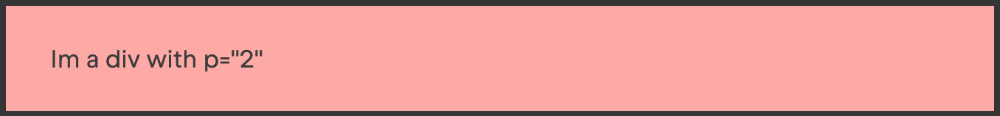

```html
<p px="2">Im a div with px="2"</p>
```
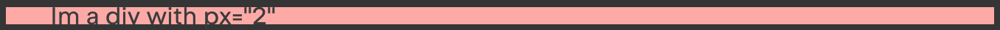

```html
<p py="2">Im a div with py="2"</p>
```
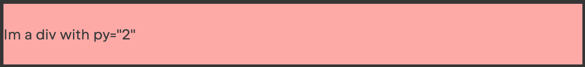

```html
<p pt="2" pl="2">Im a div with pt="2" and pl="2"</p>
```
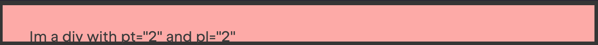

## P-recursive

```html
<div p-recursive="3">...</div>
```

The p-recursive utility lets you define a padding on all the descendants (children, grand-children, grand-grand-children etc.).

Just like the utility p, you can choose the kind of padding, so if you set `px-recusive="3"` all the descendants of the element will receive an horizontal padding of 3.

You can use the following p-recursive attributes :

- p-recursive: define a padding in every direction
- px-recursive: define an horizontal padding
- py-recursive: define vertical padding
- pt-recursive: define padding-top
- pb-recursive: define padding-bottom
- pl-recursive: define padding-left
- pr-recursive: define padding-right

### Examples 

```html
<div p-recursive="1">
    <p>Hey</p>
    <p>Guys !</p>
    <div>
        <p>I also inherit of the padding</p>
    </div>
</div>
```

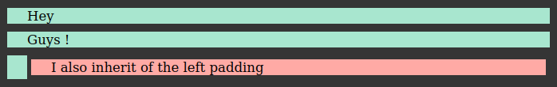
```html
<div pl-recursive="1">
    <p>Hey</p>
    <p>Guys !</p>
    <div>
        <p>I also inherit of the left padding</p>
    </div>
</div>
```
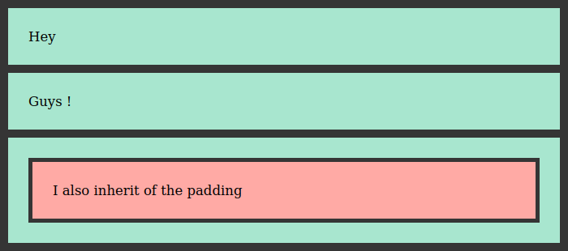

## P-child

```html
<div p-child="3">...</div>
```

The p-child utility lets you define a padding on all the children of the element.

Just like the utility p, you can choose the kind of padding, so if you set `px-child="3"` all the children of the element will receive an horizontal padding of 3.

You can use the following p-child attributes :

- p-child: define a padding in every direction
- px-child: define an horizontal padding
- py-child: define vertical padding
- pt-child: define padding-top
- pb-child: define padding-bottom
- pl-child: define padding-left
- pr-child: define padding-right

### Examples 

```html
<div p-child="1">
    <p>Hey</p>
    <p>Guys !</p>
    <div>
        <p>I dont inherit of the padding</p>
    </div>
</div>
```
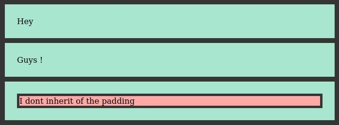

```html
<div pl-child="1">
    <p>Hey</p>
    <p>Guys !</p>
    <div>
        <p>I dont inherit of the left padding</p>
    </div>
</div>
```
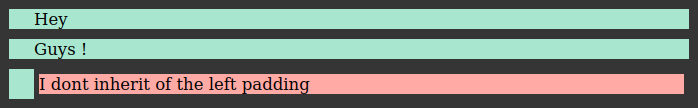

## Flex Utilities

```html
<div flex-basis="200px" flex-shrink="1" flex-grow="3" align-self="center"></div>
```

The Flex utilities are: flex-basis, flex-shrink, flex-grow and align-self.

These utilities are usable on flex elements to change their behavior, so you can use it on child elements from ledge, switcher and sidebar components.

### Examples

The `flex-basis` is used as a normal flex basis value.

Flex-basis defines the default size of an element before the remaining space is distributed.

```html
<ledge-l align="center" justify="space-around" p="0" gap="1">
  <p flex-basis="300px">Element 1</p>
  <p>Element 2</p>
  <p>Element 3</p>
</ledge-l>
```
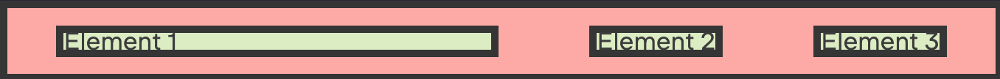
The `flex-grow` is used as a normal flex grow value.

Flex-grow defines the ability for a flex item to grow if necessary. 

```html
<ledge-l align="center" justify="space-around" p="0" gap="1">
  <p>Element 1</p>
  <p flex-grow="1">Element 2</p>
  <p flex-grow="2">Element 3</p>
</ledge-l>
```
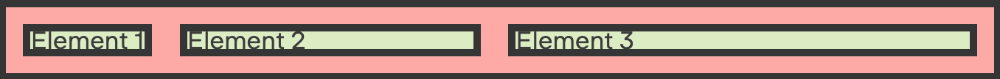
The `flex-shrink` is used as a normal flex shrink value.

Flex-shrink defines the ability for a flex item to shrink if necessary.

```html
<ledge-l align="center" justify="space-around" p="0" gap="1" nowrap>
  <p>Element Lorem ipsum dolor sit </p>
  <p>Element Lorem ipsum dolor sit </p>
  <p flex-shrink="2">Element Lorem ipsum dolor sit </p>
</ledge-l>
```
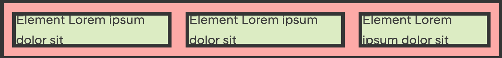

The `align-self` allows the default alignment (or the one specified by align-items) to be overridden for individual flex items.

```html
<ledge-l align="center" justify="space-around" p="0" gap="1" nowrap>
  <p align-self="start">Element Lorem ipsum dolor sit </p>
  <p align-self="end">Element Lorem ipsum dolor sit </p>
  <p p="1">Element Lorem ipsum dolor sit </p>
</ledge-l>
```
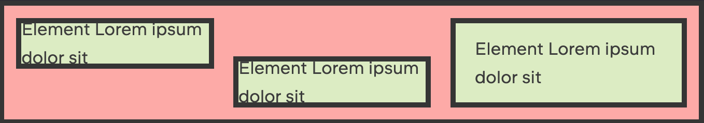

## Hide-under

```html
<div hide-under="200px">...</div>
```

The hide-under utility lets you define on breakpoint, based on the screen width, under which the element while be hidden.

### Example

```html
<div hide-under="1200px">
    <p>You can see me !</p>
</div>
```
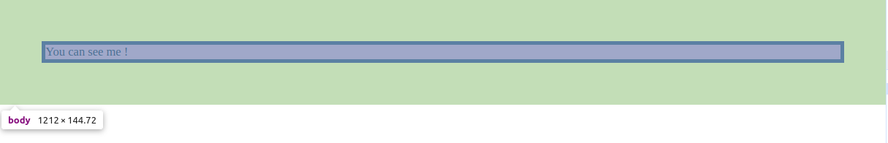

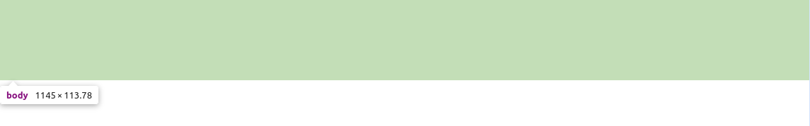


## hide-over

```html
<div hide-under="200px">...</div>
```

The hide-over utility lets you define on breakpoint, based on the screen width, above which the element while be hidden.

### Example

```html
<div hide-over="1200px">
    <p>You can see me !</p>
</div>
```
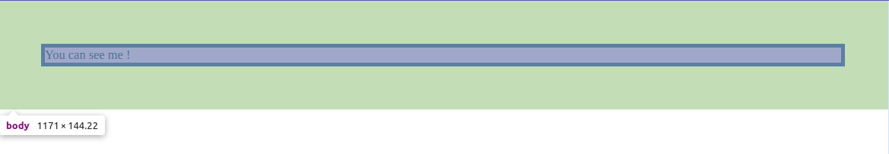


## Font-size

```html
<p font-size="2">...</p>
```

Sometimes, you need to define a specific font-size, to do so, you just need to add the font-size attribute with the desired value.

Just like the rest of the framework, those values are based on your harmonic ratio.

The value 0 is the size of the base value, the value 1 is equal to the size of a 'h3', the value 2 is equal to a 'h2', and so on.

```html
<stack-l gap="1">
  <p font-size="3">Hello World!</p>
  <p font-size="2">Hello World!</p>
  <p font-size="1">Hello World!</p>
</stack-l>
```


## Relative

```html
<div relative>...</div>
```

Relative is a utility that will define an element position to relative.

It's really usefull when you're creating an outsider, and you want to position it from it's parent.

```html
<div relative p="4">
  <outsider-l-n position="absolute" top="20px" right="100px">
    <p p="1">Hello guys !</p>
  </outsider-l-n>
</div>
```
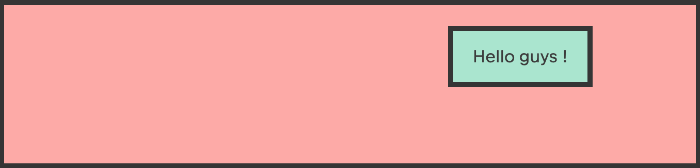

## Z-index

```html
<div z-index="10">...</div>
```

The z-index utility works just like a normal z-index.
It let you define the layer position of an element.

```html
<div relative>
  <outsider-l-n position="absolute" z-index="10" top="20px" right="100px">
    <p p="1">I'm on top !</p>
  </outsider-l-n>
  <outsider-l-n position="relative" z-index="5">
    <p p="2">I'm on bottom !</p>
  </outsider-l-n>
</div>
```
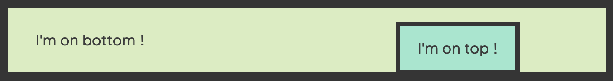

## Line-height

```html
<div line-height="3">
    <p>...</p>
    <h2>...</h2>
</div>
```

The line-height utility let's you define the line height of the text. 
You can either define it on a parent or on the text itself. 
